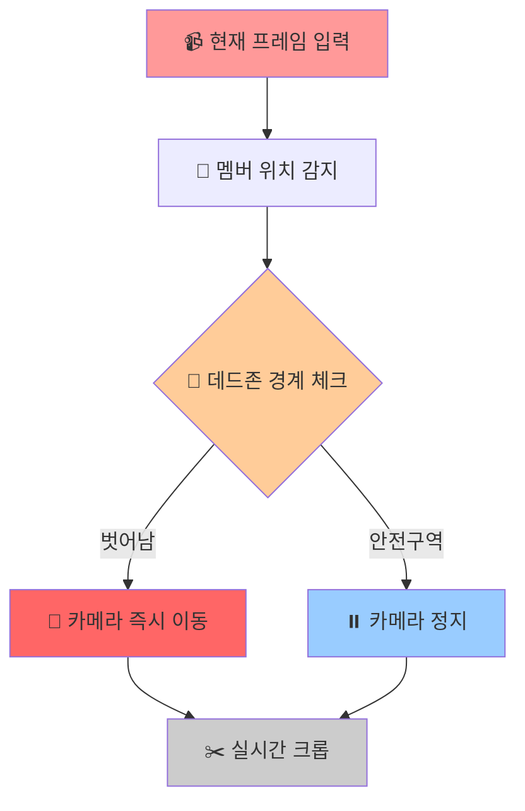
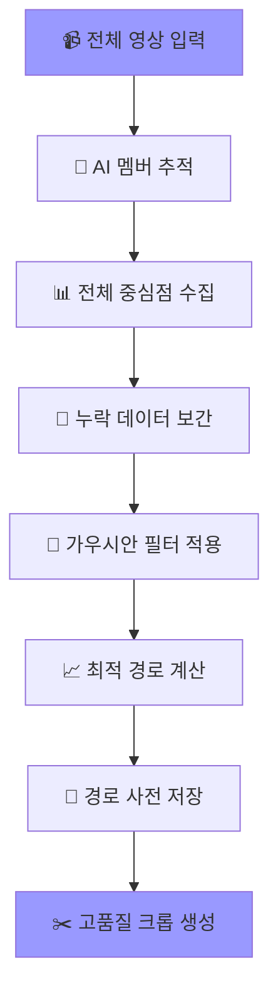

# 🔍 Automatic Crop

**Automatic Crop**은 SAMURAI 객체 추적 기술을 활용하여 K-pop 공연 영상에서 각 멤버를 자동으로 추적하고,<br/>
개인 직캠을 생성하는 지능형 영상처리 시스템입니다.<br/>

사용자가 마우스로 간단히 멤버를 선택하면, AI가 자동으로 전체 영상에서 해당 멤버를 추적하여 부드럽고 안정적인 개인 직캠을 생성합니다.

---

## 🎯 주요 기능

  - 마우스 드래그만으로 간단한 멤버 선택
  - 가우시안스무딩 알고리즘으로 떨림 없는 부드러운 움직임
  - 최대 6명의 멤버 동시 추적
  - 모든 멤버의 추적 박스 표시

---

## 🧠 핵심 기술: 가우시안 스무딩 vs 데드존 방식

  왜 가우시안 스무딩을 선택했는가?</br>
  
  - 이 프로젝트는 초기에 데드존(Dead-zone) 방식으로 개발되었지만, 더 나은 사용자 경험 및 부드러운 움직임을 위해 가우시안 스무딩 방식으로 전환했습니다.</br>

  - 실시간 스트리밍은 불가능하며 후처리 전용으로만 사용이 가능합니다.

|특성|🎯 데드존 방식|✨ 가우시안 스무딩 방식|
|------|---|---|
|실시간 처리|✅지원|❌ 불가능|
|카메라 움직임|반응적/즉석 대응|사전 계획/최적화|
|부드러움|보통(갑작스러운 움직임 가능)|부드러움|

---

<table>
  <tr>
    <td align="center"><b>비교</b></td>
  </tr>
  <tr>
    <td></td>
  </tr>
</table>

---

### ⚡ 데드존 방식



### 🎪 가우시안 스무딩 (전체 경로 최적화)


---

## ⚙️ 기술 스택

### AI/ML

 - SAMURAI (SAM 2.1) - Meta AI 객체 추적 모델
 - Gaussian Smoothing - 경로 최적화
 - Computer Vision - OpenCV 기반 영상 처리

### Backend

 - Python 3.8+
 - NumPy - 수치 연산
 - SciPy - 계산

### Frontend/UI

 - OpenCV GUI - 시각적 선택 인터페이스
 - PIL (Pillow) - 한글 텍스트 렌더링

---

## 🔧 설치 및 실행

Python 3.8 이상 필요


### SAMURAI 클론 및 다운

```bash
git clone https://github.com/yangchris11/samurai
cd samurai
# SAM 2.1 모델을 checkpoints/ 폴더에 다운로드
```

### AI-Powered-K-pop-Camera-System 클론 및 다운

```bash
git clone https://github.com/KBohyeon/AI-Powered-K-pop-Camera-System
```

### 의존성 설치

```bash
pip install opencv-python
pip install numpy
pip install pillow
pip install scipy
```

---

📊 프로젝트 구조

samuria/</br>
├── assets    </br>
├── checkpoints                
├── data               
├── lib                       
├── sam2             </br>
├── scripts    # 사무라이 객체 인식 스크립트</br>
├── multi_member_optimal_system.py    </br>
├── 영상.mp4</br>

다운로드한 multi_member_optimal_system.py와 사용할 영상.mp4가 samuria 파일에 들어있어야합니다.

---
## 🌄 실행 결과 보기
원본 화질은 아래의 구글 드라이브에서 다운로드 후 확인이 가능합니다.
>[ (※ 멤버 전체 크롭 박스 영상 링크)](https://drive.google.com/file/d/1Z8fTXFBCOgYdPK6mFNNT5SSssFEGI6tu/view?usp=drive_link)</br>
>[ (※ 개인 크롭 영상 링크)](https://drive.google.com/file/d/1r_-Mr7mPRT2HAe8ER7Z8t5xjmkcKWmwe/view?usp=drive_link)
<table>
  <tr>
    <td align="center"><b>멤버 전체 크롭 박스</b></td>
  </tr>
  <tr>
    <td></td>
  </tr>
  </table>

  <table>
    <tr>
    <td align="center"><b>개인 크롭</b></td>
  </tr>
  <tr>
    <td></td>
  </tr>
</table>
    <table>
    <tr>
    <td align="center"><b>미리 보기 GIF</b></td>
  </tr>
  <tr>
    <td></td>
  </tr>
</table>

---

## 📌 향후 개선 방향

- 실시간 스트리밍 지원
- 현재 터미널내 실행 가능 -> GUI 인터페이스 개발
- 다양한 출력 비율 지원
- 직캠 이외 스포츠 등 사용 가능하도록 개발

---

## 📮 문의

**김보현**  
- 이메일: `qhgus9346@gmail.com`

