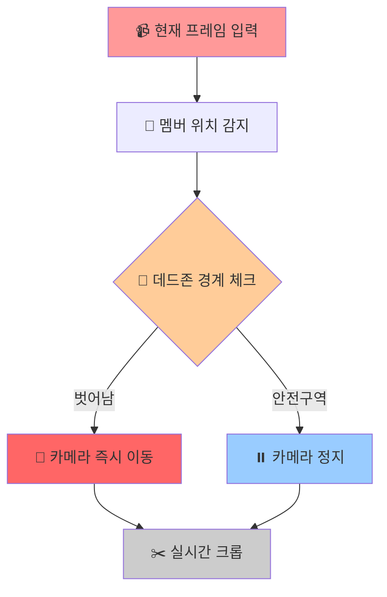
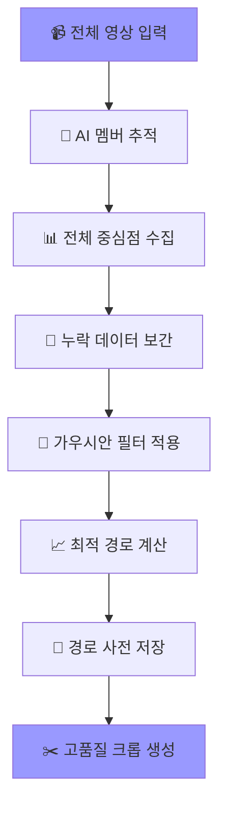
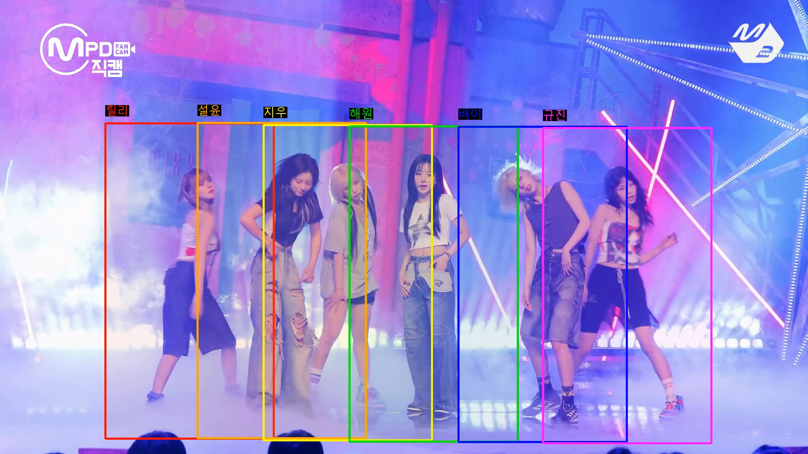

# 🔍 AI_Kpop_Camera_System

**AI_Kpop_Camera_System**은 SAMURAI AI 객체 추적 기술을 활용하여 K-pop 공연 영상에서 각 멤버를 자동으로 추적하고,<br/>
개인 직캠을 생성하는 영상처리 시스템입니다.<br/>
사용자가 마우스로 간단히 멤버를 선택하면, AI가 자동으로 전체 영상에서 해당 멤버를 추적하여 부드럽고 안정적인 개인 직캠을 생성합니다.</br>
6가지 색상 슬롯 시스템으로 최대 6명의 멤버를 동시에 처리할 수 있으며, 가우시안 스무딩 알고리즘을 통해 전문적인 카메라 워크를 구현합니다.</br>
마우스 드래그로 직관적인 멤버 선택이 가능합니다.

---

## 🎯 주요 기능

  - 마우스 드래그만으로 간단한 멤버 선택
  - 가우시안스무딩 알고리즘으로 떨림 없는 부드러운 움직임
  - 최대 6명의 멤버 동시 추적
  - 모든 멤버의 추적 박스 표시

---

## 🎯 왜 SAMURAI AI를 선택했는가?

  제로샷 학습(Zero-Shot Learning)의 장점

  📚 사전 훈련 불필요

  기존 방식은 각 아이돌의 데이터로 훈련이 필요하며 부족할시 추가 데이터 학습이 필요
  #### 기존 방식 (훈련 필요)
    model = CustomTracker()
    model.train(nmixx_dataset)     # NMIXX 데이터로 훈련 필요
    model.train(aespa_dataset)     # aespa 데이터로 추가 훈련
    model.train(newjeans_dataset)  # 그룹별 개별 훈련

  #### SAMURAI 방식 (제로샷) 
    model = SAMURAI("sam2.1_hiera_base_plus.pt")  

  Samurai 방식인 제로샷은 사전 훈련된 모델로 새로운 그룹에 적용시 즉시 적용이 가능하며 데이터 요구량 또한 초기 1프레임만으로 훈련이 가능하므로
  모든 아이돌 그룹에서 동일한 성능을 보일수 있음

  제로샷 학습의 한계점

  - 초기 선택의 중요성: 첫 바운딩 박스 품질이 전체 성능 결정
  - 극단적 변화 취약성: 완전히 다른 장면으로 전환시 추적 실패 가능 

  #### 결론: 왜 Samurai AI인가
  
    1. 범용성: 모든 아이돌 그룹에서 동일한 성능
    2. 효율성: 모델 학습을 시키지 않아도 되기에 학습 시간 단축 
    3. 한계점 극복: 아이돌 직캠의 경우 완전히 다른 장면으로 전환이 없고 무대 위를 벗어날 일이 없음
    
---

## 🧠 핵심 기술: 가우시안 스무딩 vs 데드존 방식

  왜 가우시안 스무딩을 선택했는가?</br>
  
  - 이 프로젝트는 초기에 데드존(Dead-zone) 방식으로 개발되었지만, 더 나은 사용자 경험 및 부드러운 움직임을 위해 가우시안 스무딩 방식으로 전환했습니다.</br>

  - 실시간 스트리밍은 불가능하며 후처리 전용으로만 사용이 가능합니다.

|특성|🎯 데드존 방식|✨ 가우시안 스무딩 방식|
|------|---|---|
|실시간 처리|✅지원|❌ 불가능|
|카메라 움직임|반응적/즉석 대응|사전 계획/최적화|
|부드러움|보통(갑작스러운 움직임 가능)|부드러움|

---

<table>
  <tr>
    <td align="center"><b>비교</b></td>
  </tr>
  <tr>
    <td></td>
  </tr>
</table>

---

### ⚡ 데드존 방식



### 🎪 가우시안 스무딩 (전체 경로 최적화)


---

## ⚙️ 기술 스택

### AI/ML

 - SAMURAI (SAM 2.1) - Meta AI 객체 추적 모델
 - Gaussian Smoothing - 경로 최적화
 - Computer Vision - OpenCV 기반 영상 처리

### Backend

 - Python 3.8+
 - NumPy - 수치 연산
 - SciPy - 계산

### Frontend/UI

 - OpenCV GUI - 시각적 선택 인터페이스
 - PIL (Pillow) - 한글 텍스트 렌더링

---

## 🔧 설치 및 실행

### 꼭 순서대로 하셔야 실행이 됩니다.

Python 3.8 이상 필요


### SAMURAI 클론 및 라이브러리 다운

```bash
# 1. SAMURAI 프로젝트 다운로드
git clone https://github.com/yangchris11/samurai
cd samurai

# 2. 🚨 중요! PyTorch를 먼저 설치해야 함
pip install torch>=2.3.1 torchvision>=0.18.1

# 3. SAM 2 설치 (SAMURAI 버전)
cd sam2
pip install -e .
pip install -e ".[notebooks]"

# 4. 다른 필요한 라이브러리들 설치
pip install matplotlib==3.7 tikzplotlib jpeg4py opencv-python lmdb pandas scipy loguru

# 5. SAM 2.1 체크포인트(모델 파일) 다운로드
cd ../checkpoints
./download_ckpts.sh
cd ..

# 5-1. checkpoints 폴더가 없다면(있으면 무시)
# samurai 폴더에서
mkdir checkpoints
cd checkpoints

python -c "import urllib.request; base_url = 'https://dl.fbaipublicfiles.com/segment_anything_2/092824/'; models = ['sam2.1_hiera_tiny.pt', 'sam2.1_hiera_small.pt', 'sam2.1_hiera_base_plus.pt']; [urllib.request.urlretrieve(f'{base_url}{model}', model) or print(f'✅ {model} downloaded!') for model in models]"

# SAM 2.1 모델을 checkpoints/ 폴더에 다운로드

# 6. 설치 확인(설치확인이 확실하면 안해도 상관 없습니다.)
python -c "import torch; import sam2; print('✅ PyTorch 버전:', torch.__version__); print('✅ SAM2 설치 완료!'); print('✅ 체크포인트 파일들 준비 완료!')"

#아래와 같이 뜨면 성공
✅ PyTorch 버전: 2.7.0+cpu
✅ SAM2 설치 완료!
✅ 체크포인트 파일들 준비 완료!

```

### AI-Powered-K-pop-Camera-System 클론 및 다운

```bash
git clone https://github.com/KBohyeon/AI-Powered-K-pop-Camera-System
#다운 후 samurai 파일에 복사 파일 안에 테스트 영상도 같이 있습니다(nmixx6.mp4) 
```

### 의존성 설치

```bash
pip install opencv-python
pip install numpy
pip install pillow
pip install scipy
```

### 실행

```bash
python multi_member_optimal_system.py
```

---

📊 프로젝트 구조

samuria/</br>
├── assets    </br>
├── checkpoints                
├── data               
├── lib                       
├── sam2             </br>
├── scripts    # 사무라이 객체 인식 스크립트</br>
├── multi_member_optimal_system.py    </br>
├── 영상.mp4</br>

다운로드한 multi_member_optimal_system.py와 사용할 영상.mp4가 samuria 파일에 들어있어야합니다.

---
## 🌄 실행 결과 보기
원본 화질은 아래의 구글 드라이브에서 다운로드 후 확인이 가능합니다.
>[ (※ 멤버 전체 크롭 박스 영상 링크)](https://drive.google.com/file/d/1Z8fTXFBCOgYdPK6mFNNT5SSssFEGI6tu/view?usp=drive_link)</br>
>[ (※ 개인 크롭 영상 링크)](https://drive.google.com/file/d/1r_-Mr7mPRT2HAe8ER7Z8t5xjmkcKWmwe/view?usp=drive_link)
<table>
  <tr>
    <td align="center"><b>멤버 전체 크롭 박스</b></td>
  </tr>
  <tr>
    <td></td>
  </tr>
  </table>

  <table>
    <tr>
    <td align="center"><b>개인 크롭</b></td>
  </tr>
  <tr>
    <td></td>
  </tr>
</table>
    <table>
    <tr>
    <td align="center"><b>미리 보기 GIF</b></td>
  </tr>
  <tr>
    <td></td>
  </tr>
</table>

---

## 📌 향후 개선 방향

- 실시간 스트리밍 지원
- 현재 터미널내 실행 가능 -> GUI 인터페이스 개발
- 다양한 출력 비율 지원 -> 현재 1080p 화질에 최적화 개발
- 직캠 이외 스포츠 등 사용 가능하도록 개발

---

## 📮 문의

**김보현**  
- 이메일: `qhgus9346@gmail.com`

